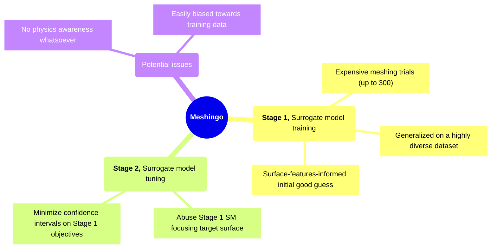

# Motivation and Objectives

---
transition: fade-out
hideInToc: true
---

# Disclaimer

 

> #### Focus of the presentation
> Because of the <ins>sheer amount of unpredictability</ins> associated with this kind of ML model,
> what is presented here is a general idea of the strengths and weaknesses during
> the prediction of a "good-enough" cell size starting from an STL file - that would be meshable on
> a mid-range laptop machine - using Bayesian Optimization.

 

> #### Swappable-components
> All components are easily <ins>swappable</ins>, including meshing tools, BO algorithms,
> objective functions for the optimization and so on...

 

> #### What to expect?
> Models trained using this approach are <vis>not supposed to be general-purpose</vis>:
> - There is a "range" of predictable cell size a model is valid for
>   (dictated by objective functions, parameter ranges, training data).
    Eg. A model would only function within (1e-6, 1e-2) range of cell sizes
> - This approach is in <ins>very early stages</ins> of development, so it is best used
>   to infer insights instead of actual 

---
transition: fade-out
hideInToc: true
---

# More Disclaimers

 

> #### Sample surrogate models
> The sample surrogate shown here was trained for ~130 trials on unprocessed STL files
> (~60 models downloaded from all over the internet). The testing STLs were of course
> never seen by the surrogate.

 

> #### Unprocessed STLs?
> In production, the training dataset must be made invariant to rotation, scale, and number
> of its triangles. `cartesianMesh` doesn't care about number of triangles but objective
> functions must. 

 

> #### Debating decision records
> I keep a public log of [ADRs](https://github.com/FoamScience/meshingo)
> which you can debate at any point, by PR'ing against the respective markdown file. Feel free
> to create new markdown files there if you feel new decisions need to be discussed.
