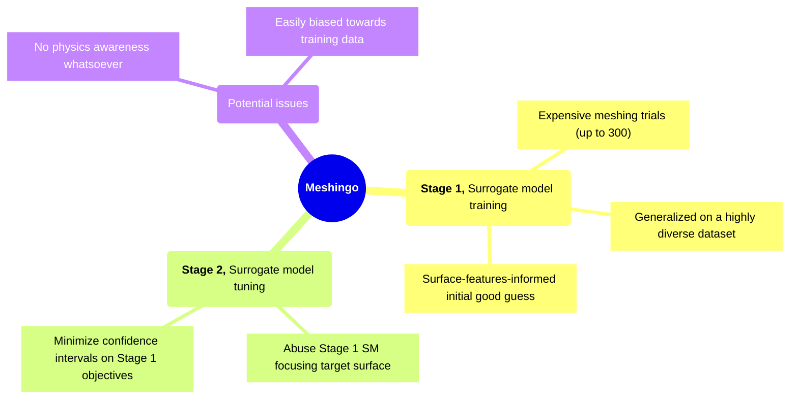

# Motivation and Objectives




---
transition: fade-out
hideInToc: false
---

# Disclaimers


<br/>


> #### Focus of the presentation
> Because of the <ins>sheer amount of unpredictability</ins> associated with this kind of ML model,
> what is presented here is a general idea of the strengths and weaknesses during
> the prediction of a "good-enough" cell size starting from an STL file - that would be meshable on
> a mid-range laptop machine - using Bayesian Optimization.

<br/>
<v-click at="1">

> #### Swappable-components
> All components are easily <ins>swappable</ins>, including meshing tools, BO algorithms,
> objective functions for the optimization and so on...

</v-click>
<br/>
<v-click at="2">

> #### What to expect?
> Models trained using this approach are <vis>not supposed to be general-purpose</vis>:
> - There is a "range" of predictable cell size a model is valid for
>   (dictated by objective functions, parameter ranges, training data).
    Eg. A model would only function within (1e-6, 1e-2) range of cell sizes
> - This approach is in <ins>very early stages</ins> of development, so it is best used
>   to infer insights instead of actual 

</v-click>

---
transition: fade-out
hideInToc: true
---

# More Disclaimers

<br/>

> #### Sample surrogate models
> The sample surrogate shown here was trained for ~130 trials
> (\~100 of which were successful)
> on unprocessed STL files (~60 models downloaded from all over the internet).
> The testing STLs were of course never seen by the surrogate.

<br/>

> #### Unprocessed STLs?
> In production, the training dataset must be made invariant to rotation, scale, and number
> of its triangles. `cartesianMesh` doesn't care about number of triangles but objective
> functions must. 

<br/>
<v-click at="1">

> #### Debating decision records
> I keep a public log of [ADRs](https://github.com/FoamScience/meshingo/tree/main/ADRs)
> which you can debate at any point, by PR'ing against the respective markdown file. Feel free
> to create new markdown files there if you feel new decisions need to be discussed.

</v-click>

---
transition: fade-out
hideInToc: false
---

# Instant Cell Size predictions!

Try it out now! It's really just one command (at least for the 1st stage)!

```bash {all|8-14|all}
# Get a sample surrogate model; shipped with an Apptainer container
apptainer pull meshingo.sif oras://ghcr.io/foamscience/meshingo:0.0.1
# Get oriented, see where things are, and what is available
apptainer run meshingo.sif info
# Get meshingo out of the container (can also just clone)
apptainer run meshingo "cp /opt/meshingo meshingo" && cd meshingo

# Get SLT model in place
cp '<your-stl-file>' testing_dataset
# Use the surrogate to get a few (at least 2) case configurations
apptainer run meshingo.sif 'meshingo validate
          --model /opt/surrogates/Meshingo
          --training-set /opt/surrogates/geometric_features.csv
          testing_dataset/<your-stl-file>'

# Inspect the respective meshDict files to minimal/maximal cell sizes
foamDictionary -expand <case_path>/system/meshDict

apptainer run meshingo.sif 'meshingo --help' # for more stuff to do
```

---
transition: fade-out
hideInToc: false
---

# Instant Cell Size predictions!

You get "objective-oriented" suggestions

```json
{
    "125": {
        "job_id": 2885729,
        "case_path": "/tmp/meshingo/trials/Meshingo_trial_bd1bd3261cad5dae7e66f3e3f65aa203",
        "case_name": "Meshingo_trial_bd1bd3261cad5dae7e66f3e3f65aa203",
        "best_for_objectives": [
            "SurfaceDifference"
        ],
        "predictions": {
            "CellSizeDecayed": 0.228648880741723,
            "SurfaceDifference": -0.0279852980695916,
            "MeshIssues": 1.3640759324078426,
            "CellCount": 8.473390924663022
        }
    },
    ...
}
```
