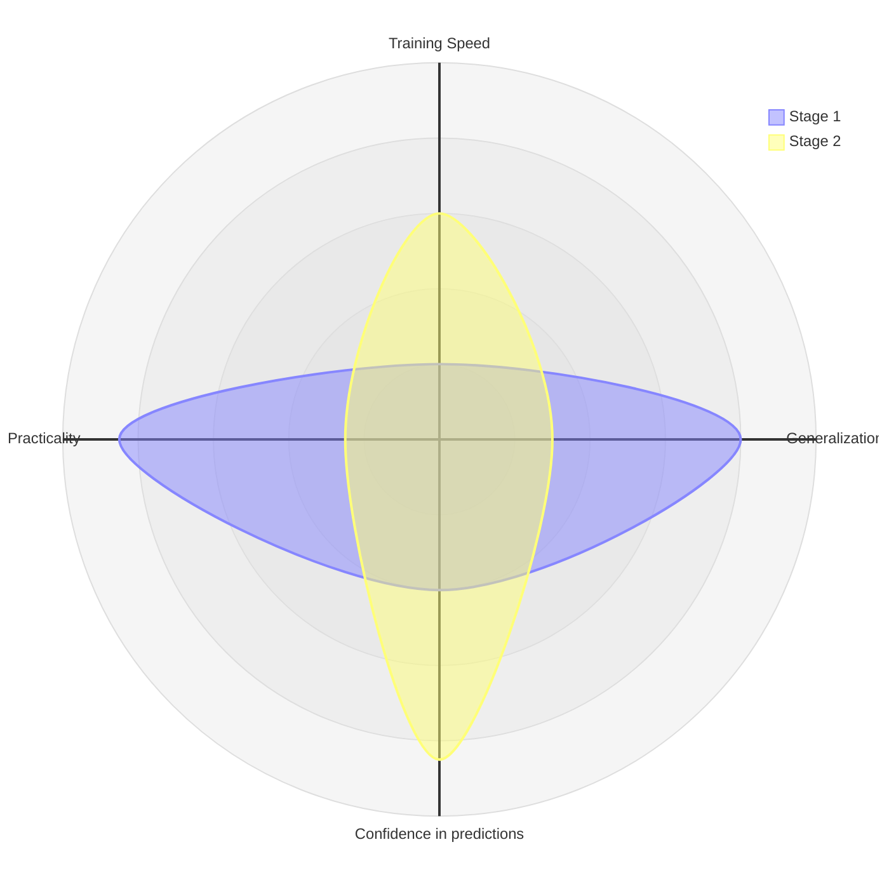
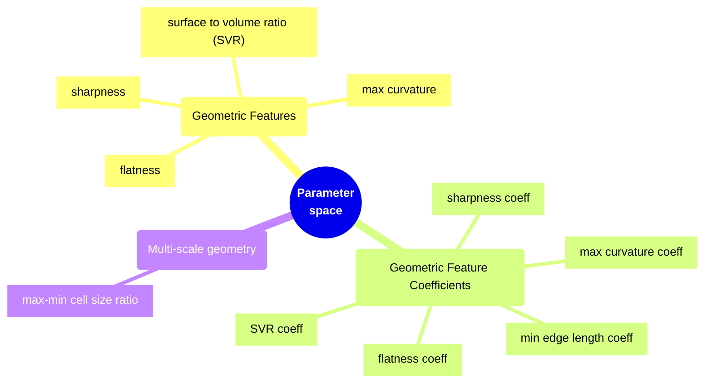
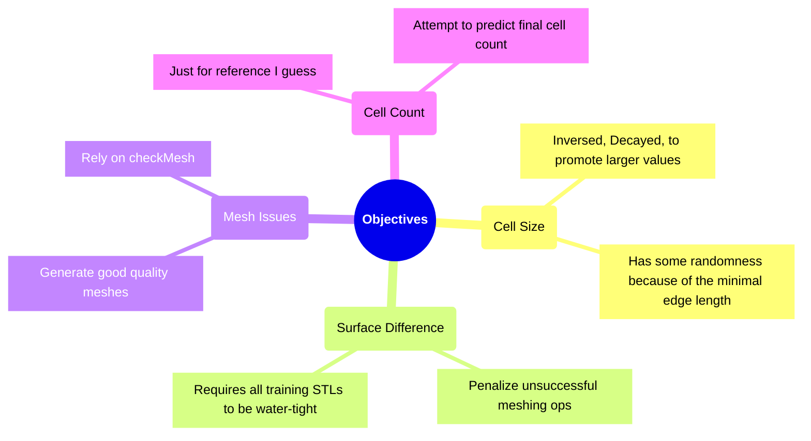
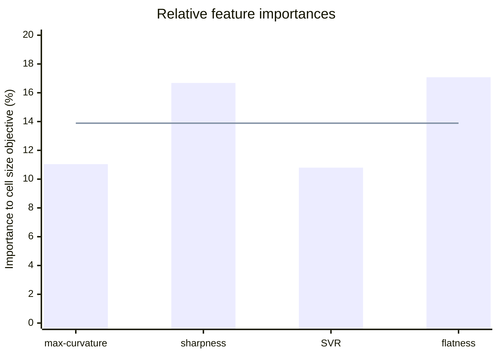
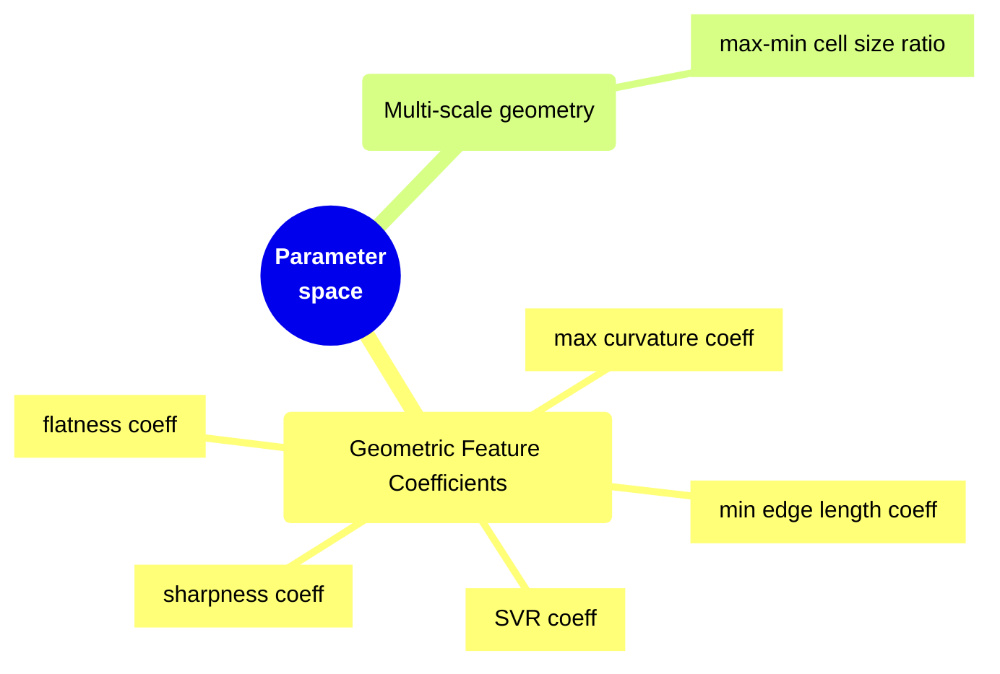
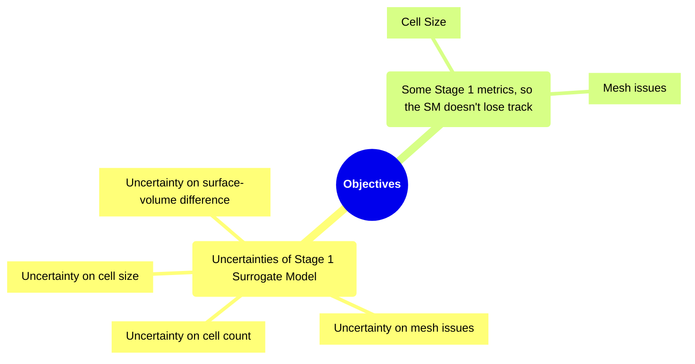

# Bayesian Optimization setup

Tech Stack used:

<v-clicks>

1. [cfMesh's](https://cfmesh.com/cfmesh-open-source/) `cartesianMesh` as a meshing tool.
   <Arrow v-bind="{ x1:450, y1:180, x2:700, y2:145 }" color="var(--slidev-theme-error)" />
1. [foamBO](https://github.com/FoamScience/OpenFOAM-Multi-Objective-Optimization) as the optimization driver for both stages.
   - Unattended choice of the BO algorithms hyper-parameters
     <Arrow v-bind="{ x1:450, y1:280, x2:560, y2:295 }" color="var(--slidev-theme-primary)" />
   - Based on Parameter range/type + Objectives
1. [meshingo]() Python package to handle
   - Geometric feature evaluation for surface STLs
   - Objective function evaluation
     <Arrow v-bind="{ x1:450, y1:470, x2:680, y2:450 }" color="var(--slidev-theme-primary)" />

</v-clicks>


::right::

<br/><br/>




---
level: 2
---

## A convenient CLI for the whole workflow

<br/>
<a class="absolute right-15 text-xl i-carbon:document-multiple-01" href="https://github.com/FoamScience/meshingo/blob/main/app/docs/index.md"> </a>
Get a good bunch of STL models, and

```bash {all|1-2|4-5|7-12|14-15|17-18|all}
# Install needed dependencies
./app/meshingo install

# Prepare your STLs, only needed for training stage
cp <my_STLs*> training_dataset/

# Training stage, run once to produce a surrogate model
export STAGE1_MAX_OCTREES=9 # Optional, default is 9, more means more RAM usage
./app/meshingo train --stage1-name Meshingo training_dataset

# Try it on a target STL (takes only few seconds to setup meshing cases)
./app/meshing validate --model stage1/Meshingo <path_to_stl>

# See if SM is biased towards some geometric features [optional]
./app/meshingo bias-scan --stage1-name Meshingo --threshold 0.05

# Fine-tuning stage, uses the SM instead of the meshing tool [optional]
./app/meshingo predict --stage1-name Meshingo --stage2-name MY_TARGET <path_to_STL>
```

---
level: 2
hideInToc: false
---

## Stage 1 - Surrogate model training




---
level: 2
hideInToc: true
---

## Stage 1 - Surrogate model training

<br/>

The `Cell-Size` objective function is calculated as follows, then an inverse-decay is applied:


<br/>

<v-clicks>

- These are picked by the BO Algorithm for each trial,<br/>
  Most similar surface from dataset is picked for meshing...
  <Arrow v-bind="{ x2:140, y2:225, x1:250, y1:280 }" color="var(--slidev-theme-primary)" />
  <Arrow v-bind="{ x2:340, y2:225, x1:250, y1:280 }" color="var(--slidev-theme-primary)" />


- <span v-mark.circle.orange="2">Minimal edge length,</span> is the smallest length that is supposed to capture all surface features.<br/>
  Prematurely computed by flooding the STL with rays and recording shortest ray-model intersection distances
  <Arrow v-bind="{ x1:610, y1:225, x2:610, y2:340 }" color="var(--slidev-theme-primary)" />

</v-clicks>

---
level: 2
hideInToc: true
---

## Stage 1 - Surrogate model training





---
level: 2
hideInToc: false
layout: two-cols
---

# Investigating Objective Functions for Stage 1

- Best settings for focusing on `CellSize/Count`, and `Mesh Issues`
  - Min Cell Size: **5.48968e-05**
  - Max/Min aspect ratio: **10.1755**
   <Arrow v-bind="{ x1:350, y1:240, x2:490, y2:200 }" color="var(--slidev-theme-error)" />
  - 1 050 183 cells, no mesh issues

- Best settings for focusing on `SurfaceDifference`
  - Min Cell Size: **4.35166e-05**
  - Max/Min aspect ratio: **69.793**
   <Arrow v-bind="{ x1:350, y1:400, x2:490, y2:420 }" color="var(--slidev-theme-primary)" />
  - 713 235 cells, no mesh issues

::right::

<br/><br/>

{width=500px lazy}

---
level: 3
hideInToc: true
layout: two-cols
---

## Investigating Objective Functions for Stage 1

<br>

<v-clicks>

- `SurfaceDifference` metric is **currently not so good**;
  Doesn't translate to "smaller value is better"!

- Can discover **random `cartensianMesh` bugs**?
  <Arrow v-bind="{ x1:460, y1:230, x2:620, y2:320 }" color="var(--slidev-theme-error)" />

- Overall, the Pareto Frontier data, used on unseen STL files
  1. provides a decent cell size out of stage 1
  2. needs some polishing around curvy/spherical regions

</v-clicks>

::right::

<br/> <br/>

<v-click at="1">

```tikzjax {calc}
\begin{document}
\begin{tikzpicture}[domain=-4:1,scale=1.1]
\draw[thick] (-1, 0) -- (1, 0);
\draw[thick] (-4, 0) -- (-2, 0);
\fill[red, opacity=0.7] 
  (-1, 0) 
  \foreach \x in {-1, -0.9, ..., 1} { -- (\x, {0.5*\x*\x*\x + 0.5*\x}) }
  -- (1, 0) -- cycle;
\fill[blue, opacity=0.6] 
  (-2, 0) -- (-2, -1)
  \foreach \x in {-2, -2.1, ..., -4} { -- (\x, {0.2/\x}) }
  -- (-4, 0) -- cycle;
\end{tikzpicture}
\end{document}
```

<v-drag text-3xl pos="700,110,40,43">
    <div class="i-carbon:thumbs-up-double-filled" style="color:var(--slidev-theme-error)"></div>
    <Arrow v-bind="{ x1:25, y1:48, x2:25, y2:240 }" color="var(--slidev-theme-error)" />
</v-drag>

<v-drag text-3xl pos="470,110,40,43">
    <div class="i-carbon:thumbs-down-filled" style="color:var(--slidev-theme-error)"></div>
</v-drag>
</v-click>

<br/><br/>

{width=1200px lazy}

---
level: 3
hideInToc: true
layout: two-cols
---

## Investigating Objective Functions for Stage 1

{width=1200px lazy}

::right::

<br/><br/>

- BTW, This is how the STL file looks like.
- Red lines denote (auto) detected feature edges. This one was missed on purpose 
  <Arrow v-bind="{ x1:490, y1:170, x2:290, y2:200 }" color="var(--slidev-theme-error)" />
  - Delegating cell size to "feature-edges angle"
  - But predictions are way off (`1e-3` training improvement bar):
    | Model inference | Cell count | mesh issues |
    | :---: | :---: | :---: |
    | SD | 25.3m | 1 |
    | SCI | 21.3m | 0 |

---
level: 2
hideInToc: false
layout: two-cols
---

## Checking for model Bias

We got a surrogate model from Stage 1, hopefully a well trained GP.



::right::

<br/> <br/> <br/>
<br/> <br/> <br/>
<br/>

- This model is **a little** biased towards <span v-mark.circle.orange="1">sharp</span>
  and <span v-mark.circle.orange="1">flat</span> surfaces.
- But this might be OK if the model is supposed to work on a certain "type" of surface models.

---
level: 2
hideInToc: false
---

## Stage 2 - Surrogate model fine-tuning



---
level: 2
hideInToc: true
---

## Stage 2 - Surrogate model fine-tuning




---
level: 2
hideInToc: true
---

## Stage 2 - Surrogate model fine-tuning

<br/>

- Now, we take the surrogate model from Stage 1, and <span v-mark.orange="1">use it instead</span> of the meshing tool 
  - This is much faster
  - But bias from Stage 1 is inherited
- Instead of picking the most similar surface from a training set, <span v-mark.orange="2">use the target STL</span>
  - This helps the model discover around the target STL
  - But takes a bit of time (additional 30-40 trials)

<br/>

- By the end, a pareto-frontier is generated for the Stage 2 objectives
  - A few cell sizes are suggested, together with their predicted performance
  - The user can then choose the cell size to use based on their impact on the objectives

---
level: 2
hideInToc: true
layout: two-cols
---

## Stage 2 - Surrogate model fine-tuning


{width=350px lazy}

Top, best for `CellSize` and uncertainty on `SurfaceDifference`
<br>
Bottom, best for uncertainty on `cellSize`, `Cell Count` and `Mesh issues`, and the `Mesh Issues` objective itself

::right::

<br/><br/>

{width=230px align=right lazy}

| | Cell Size | maxMin ratio | Cell Count (CI) |
|:---:|:---:|:---:|:---:|
|SZ | 4.34e-05 | 350 | 854.594k (13%) |
| U(CCI) | 2.96e-04 | 10 | 92.424k (9%) |

---
level: 2
hideInToc: true
---

## Stage 2 - Surrogate model fine-tuning - Remarks

<br/>
<br/>

- Current implementation <ins>is inefficient</ins>
  - Re-fits the surrogate model on each trial
  - Depending on the target STL, might need 200+ trials to converge
    - to a `1e-3` improvement bar

<br/>

- Reducing confidence intervals still doesn't make predictions on `CellCount`
  fall within the confidence intervals
  - Probably needs way more trials
  - Cell count is normalized by STL surface area. Any wrong doings here?

---
level: 2
hideInToc: true
---

## Stage 2 - Surrogate model fine-tuning - Remarks

<br/>
<br/>

- Does the improvement in finding lower-cell-count configurations
  justify the extra effort for stage 2?
- Maybe a BO in 2nd stage isn't the best use of Bayesian Optimization?
  - <ins>Active learning?</ins> Refining/Validating untrusted regions from stage 1
  - <ins>Multi-fidelity BO for stage 2?</ins> Picking whether to use the surrogate or performing
    an actual meshing operation... BUT this will mesh the target STL multiple times
- Explore models other than Gussian Processes?

<br/>

For now, stage 2 is there just for deriving insights and experimenting with the surrogate model


---
level: 2
hideInToc: true
---

## The full story (ADRs)

<div style="padding:5px" />
<AdrTable />
